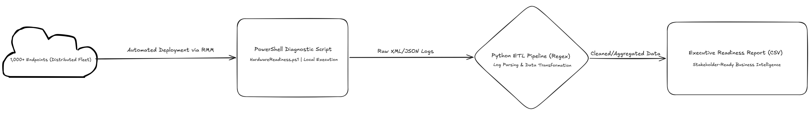

# Windows 11 Enterprise Readiness Reporting Pipeline

## 📊 Project Overview
This project provides an automated reporting layer for large-scale Windows 11 migrations. It bridges the gap between raw technical audits and executive-level decision-making. 

I developed this pipeline to manage a **1,000+ endpoint environment** across 30+ corporate clients, reducing manual reporting overhead by **90%**.

## 🛠️ The Pipeline
The workflow consists of two distinct phases:

### Phase 1: Data Collection (Microsoft Hardware Readiness)
The pipeline utilizes the official [Microsoft HardwareReadiness.ps1](https://techcommunity.microsoft.com/t/306041) script to perform local hardware validation for TPM 2.0, UEFI, and CPU compatibility. 

### Phase 2: Custom ETL & Aggregation (Python)
I engineered a custom Python-based **ETL (Extract, Transform, Load)** tool (`process_audit_logs.py`) to solve the scalability issue of the Microsoft script. 
* **Log Parsing:** Utilizes **Regular Expressions (Regex)** to extract nested JSON return codes and status messages from raw `.txt` log exports.
* **Batch Processing:** Automatically scans directories for multiple client site exports and identifies "Expired" or "In-progress" tasks to pinpoint network/power failures.
* **Executive Reporting:** Aggregates messy raw data into a localized, C-suite-ready CSV report for regional stakeholders.

## 📈 Business Impact
* **Scalability:** Transformed a manual one-by-one log check into a batch-processed pipeline capable of auditing 1,000+ nodes in seconds.
* **Accuracy:** Identified "Unknown" statuses caused by unreachable systems, ensuring zero data gaps during refresh planning.
* **Strategic Value:** Provided the data used by CEOs to authorize multi-million dollar hardware refresh budgets.

## 💻 Technical Stack
* **Language:** Python 3.x
* **Core Modules:** `re` (Regex), `csv`, `os`
* **Dependency:** Microsoft HardwareReadiness.ps1
