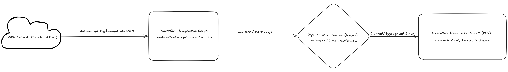

# Windows 11 Enterprise Readiness Reporting Pipeline

## 📊 Project Overview

Asked to determine which machines across our client base could run Windows 11 —
with no method defined for how to do it. This is what I built: a two-stage
pipeline that collects hardware readiness data from every endpoint and turns the
raw output into reports a client executive can actually act on.

Deployed across a **1,000+ endpoint environment** for 30+ corporate clients,
cutting manual audit labor by roughly **85%**.



## 🛠️ The Pipeline

### Phase 1: Data Collection

Microsoft's official `HardwareReadiness.ps1` script, pushed to all endpoints via
N-Central script policy. It validates TPM 2.0, Secure Boot / UEFI, CPU
compatibility, RAM, and storage — and returns the results as raw text.

### Phase 2: Parsing & Aggregation (Python)

The Microsoft script reports on one machine at a time, in a format nobody wants
to read. `process_audit_logs.py` closes that gap.

* **Log parsing:** Regex extraction of `returnCode` and `returnReason` values
  from the nested JSON embedded in raw `.txt` exports.
* **Batch processing:** Scans the working directory for every `.txt` export and
  processes all client sites in a single run.
* **Unreachable machine handling:** Detects `Expired` and `In progress` task
  states and flags those endpoints as unknown rather than failed — a machine
  that was powered off is a different problem from a machine that can't run
  Windows 11.
* **Deduplication:** Tracks machines by name so repeated entries in the export
  don't produce duplicate rows.
* **Structured output:** Writes a single CSV with a labeled section per client
  site, listing each machine, its upgrade status, and the specific reason it
  can't upgrade.

## 📈 Impact

* **Scale:** Replaced one-by-one log review with batch parsing — audit logs from
  1,000+ endpoints processed in seconds.
* **Accuracy:** Separating unreachable machines from genuinely incompatible ones
  meant no silent gaps in refresh planning.
* **Decision support:** The reports went to client executives and drove phased
  hardware refresh approvals.

## ⚙️ Usage

Drop the `.txt` exports in the same directory as the script and run:

```
python process_audit_logs.py
```

Output is written to `combined_results.csv` in that directory.

## 💻 Technical Stack

* **Language:** Python 3.x
* **Core modules:** `re`, `csv`, `os`
* **Collection:** Microsoft HardwareReadiness.ps1, deployed via N-Central

## 📝 Notes

Built in a single day alongside normal ticket load, roughly three months into
the role. The hard part wasn't the parsing — it was recognizing that raw
per-machine output was useless for the decision that actually needed to be made.
